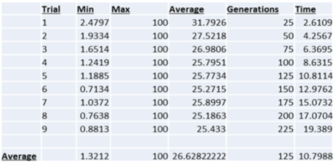
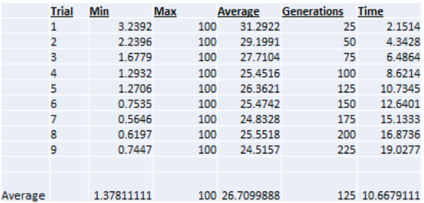
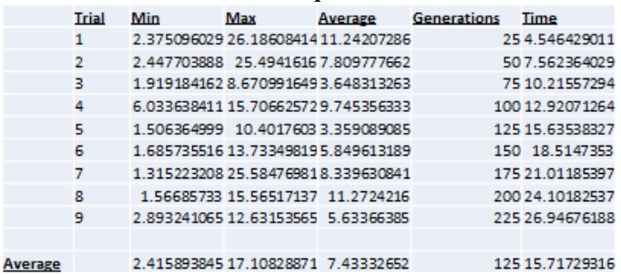
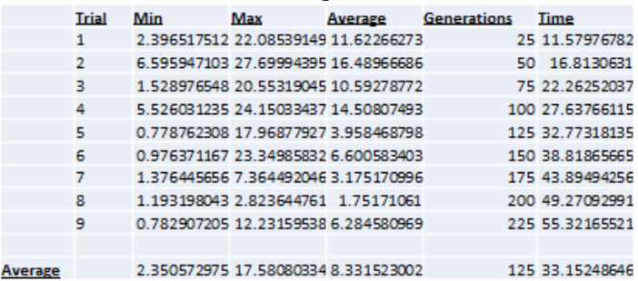
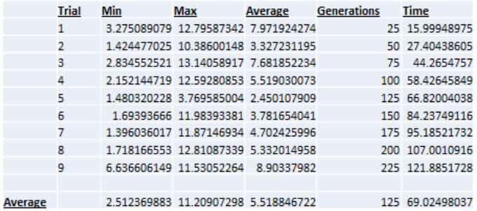
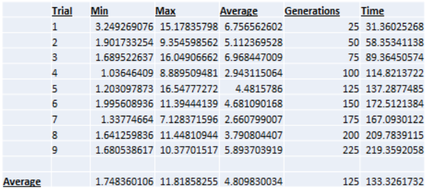

# Improving Imaging By Using Genetic Algorithms To Find Arbitrary Profiles of Bessel Beam Laser
* **Author:** Leon Hunter
* **Project Advisor:** Dr. Tomasz Smolinski1, Dr. Thomas Planchon2
* **Date:** December 2015

### Abstract
Adaptive optics is a process used to enhance the performance of an optical system by reducing the effect of wave front distortions using an active optic (deformable mirror or spatial light modulator SLM). One approach to achieving such an enhancement is the use of genetic algorithms to control the optimization of the active optics. The goal of the project was to develop a genetic algorithm to later control a spatial light modulator (SLM) used for shaping the profile of a laser beam. A spatial light modulator is a device capable of manipulating amplitude, phase, or polarization of light waves in space and time. Naturally, the shape of a laser follows a Gaussian function. There is a lot of interest in using shapes other than Gaussian to improve the techniques of measurement for cymatic devices. This talk will present the results of an experiment performed using a genetic algorithm used to optimize a SLM. Various measurements of resulting laser profiles from our simulated experiments will be presented.

### Background
In the Biophotonic Imaging Laboratory, nematodes named “Caenorhabditis elegans” (C. elegans) are imaged for tissue samples and cellular analysis. The current imaging technique uses a Guassian emission of light. With this technique, a saturation of photons is beamed at the focal point of the light being emitted. This high intensity emission can induce biological samples with phototoxicity, and subsequently destroy the specimen and resulting image. 

### Objective

The spatial light modulator is the active optic used shape the profile of the laser beam. The objective is to optimize the shape of our SLM such that the measured planes before the focal point, at the focal point, and after the focal point, all have similar profiles.

### Determining a good solution
<table>
	<tr>
		<td></td>
		<td></td>
	</tr>
</table>	

The similarities of the profiles are determined by comparing each plane with every other plane. The first plane is compared to the second and last. Then, the second plane is compared to the last. In the most ideal case, the shape of the SLM will emit a beam whose planes are identical in terms of absolute difference. The images below are plots of two candidate solutions. On the left, three functions are super imposed on a single figure. It is visibly clear that their profiles are very similar. On the right, another candidate solution is plotted. This figure is an example of a bad solution as the profile of the planes do not share a strong likeness of each other.

### Methodology 
Evolutionary algorithm was the method used to optimize the shape of the SLM. The makings of Genetic Algorithms can be summarized as parents1, reproduction2, offspring3, and selection4. Parents (chromosomes) contain properties (genes) to be reproduced and passed to offspring who may or may not survive depending on how well-suited they are for their environment (problem). Reproduction (hybridization) is the process of parents’ genetic information being copied, mixed, and mutated. Offspring are the resulting entities whose properties are yielded by reproduction. Selection is the action(s) that decide which offspring are most suited for parenting. Selection is determined by the definition of the fitness function in a genetic algorithm. A fitness function evaluates the goodness of a parent (genetic solution).

### Approach
In the process of developing the code, 6 approaches were used. Each approach generates a polynomial function that is used to describe the shape of the SLM. Two approaches do not make use of MatLab’s Global Optimization toolbox. Four approaches do. Of the four using the toolbox, two use a custom mutation function embedded in the fitness function.
The first, is Technique A. Technique A passes an arbitrary but symmetrically distributed polynomial function to the SLM. The second is Technique B. Technique B is like Technique A, but it does not impose symmetry on the function being passed. The third is Technique A0 which is similar to technique A, but it uses the toolbox. The fourth is Technique A1 which is comparable technique A0, but it uses the custom mutation method. The fifth is Technique B0 which is related technique B, but it uses the toolbox. The final is Technique B1, which resembles technique B0, but it uses the custom mutation method.
The matrix below is a breakdown of the techniques and their definitions.

<table>
<tr>
	<td>Technique</td>
	<td>Toolbox</td>
	<td>Custom Mutation</td>
	<td>Symmetry Imposed</td>
</tr>

<tr>
	<td>A</td>
	<td>no</td>
	<td>no</td>
	<td>yes</td>
</tr>

<tr>
	<td>B</td>
	<td>no</td>
	<td>no</td>
	<td>no</td>
</tr>

<tr>
	<td>A0</td>
	<td>yes</td>
	<td>no</td>
	<td>yes</td>
</tr>

<tr>
	<td>A1</td>
	<td>yes</td>
	<td>yes</td>
	<td>yes</td>
</tr>

<tr>
	<td>B0</td>
	<td>yes</td>
	<td>no</td>
	<td>no</td>
</tr>

<tr>
	<td>B1</td>
	<td>yes</td>
	<td>yes</td>
	<td>no</td>
</tr>
</table>

### Custom Mutation Method

This finite state machine describes how the custom mutation method works. First, the solution is passed to the Laser Propagation. The laser propagates and returns a score. The score is stored in a vector called local_scores. If the lowest value in local_scores is greater than or equal to the minimum score allowed, then check if the recursion limit is greater than or equal to the vector length. If it is, then there is a 20% chance of creating a new solution and an 80% chance of mutating current solution. Then, pass the new entity, along with the vector, to the laser propagation and repeat the process. If recursion limit is less than vector length, or the lowest value in local scores is less than minimum scored allowed, then return the minimum value (best score) in the vector. 
The goal of this custom mutation method was to weed out solutions with very poor fitness scores. Intuitively, solutions with very bad scores must provide no value to the gene pool. However, after further analysis, it was observed that this did not always hold true. While an individual may not perform well against its environment, it still may contain some useful genetic information. Perhaps a gene is too prominent, or may it’s so obscure (recessive) it seems to be nonexistent.

### Local Optima

Nonetheless, it’s these kinds of extreme fluctuations that help diversify a population. As diversity decreases, the likelihood of becoming stuck in a local optima increases. Local optima are relative best solutions within a neighbor solution set. Because of this, the algorithm may never achieve a global optima because its solutions seem to be ideal relative to other nearby solutions. Just by observing the image here, you can see how significant a single mutation can be to a population.

### Reproduction

In a genetic algorithm, the crossover functions describe how two individuals combine information to yield offspring. For techniques not using the toolbox, new solutions combine with the better half of parents by adding or subtracting values from respective genes. For techniques using the toolbox, the crossover function uses a random binary scatter approach. First, a random binary vector is created. Then, the indices of its 0’s are retrieved. After, genes from parent 1 with the same indices that have been retrieved are selected. Next, the remaining indices are matched with the genes from parent 2. Finally, a new chromosome is produced by merging the two sets of selected genes. The spreadsheet and flow chart wrapped within this paragraph describe how the toolbox’s mutation method works.

### Results
Each experiment was tested with 20 members, 20 genes, and a phase range of 100. It should be noted that the issue of solutions becoming stagnant in a local optima was typically not a problem for techniques using the custom mutation method. Though it did reduce the speed of execution, on average it improved the fitness scores. The charts below display the data for the corresponding methods used.

<table>
<tr>
<td></td>
<td></td>
</tr>

<tr>
<td></td>
<td></td>
</tr>

<tr>
<td></td>
<td></td>
</tr>

</table>

### Conclusion

* The chart above summarizes the data as it displays the averages of each column from each respective technique-chart.
* The scoring method of the no toolbox projects are fallible. If the minimum intensity of a plane is less than 0.2, then it is given the score of 100. This causes the calculated mean values to become inflated, making it difficult to identify why the values are so large on average without background on the internal mechanics of the fitness function. It also fails to discern the difference between a useful solution with low intensity, and one that is not useful; they are both given the same grade. Instead, the method for evaluating fitness should be normalized. However, the projects not using the toolbox seem to be very capable of producing viable solutions. In fact, according to the data, the best fitness scores from all the populations come from the two not using the toolbox. These two solutions converge more quickly on average. One possible explanation is that using the toolbox is more computationally intensive as it tries to optimize the problem. Also, there is the possibility that a default option in the GA has been overlooked and is interfering with speed and accuracy of convergence.


### Future Work
In the future, I would like this project to interface with real hardware rather than simulated. This way, we can establish the feasibility of these methods. After demonstrating proof of concept, the solution can be applied to various fields of science faced with similar cymatic issues.